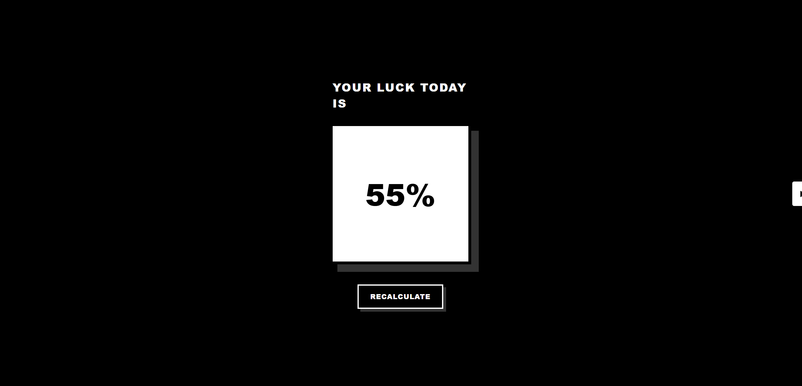

# 🎲 Test Today's Luck

A fun and interactive web app that lets you **test your luck for the day** with a playful spinner.
Your luck is shown as a percentage, along with stats tracking your spins, averages, and more — all saved in your browser.

[Live Demo](https://prospektai.github.io/todays-luck/)

---

## 🚀 Features

- 🎯 **Luck Test** – Generate a random luck percentage with animated effects.
- 📊 **Statistics Panel** – Track:
  - Total spins
  - Average luck
  - Highest and lowest results
- 🔒 **Restrict Mode** – Option to limit yourself to 3 spins per day.
- 🧹 **Clear Stats** – Reset your saved statistics anytime.
- 💾 **Persistent Storage** – Stats and settings saved with `localStorage`.
- 📱 **Responsive Design** – Works on desktop and mobile.

---

## 🖼️ Demo Screenshots

---

## 📂 Project Structure

Everything is self-contained in one file — no external dependencies required.

---

## ⚡ How to Use

1. Download or copy the `index.html` file.
2. Open it in any modern browser.
3. Click **"Test Today's Luck"** to get your result.
4. Explore the stats panel on the right-hand side.

---

## 🔧 Customization

- 🎨 Edit CSS inside `<style>` to tweak colors, fonts, and animations.
- 🔢 Adjust spin restrictions by modifying logic in the `recalculate()` function.
- 🗑️ Stats persistence uses `localStorage` — clear browser storage to reset completely.

---

## 📜 License

This project is open-source and free to use.
Feel free to modify, share, and have fun with it! 🎉

---
